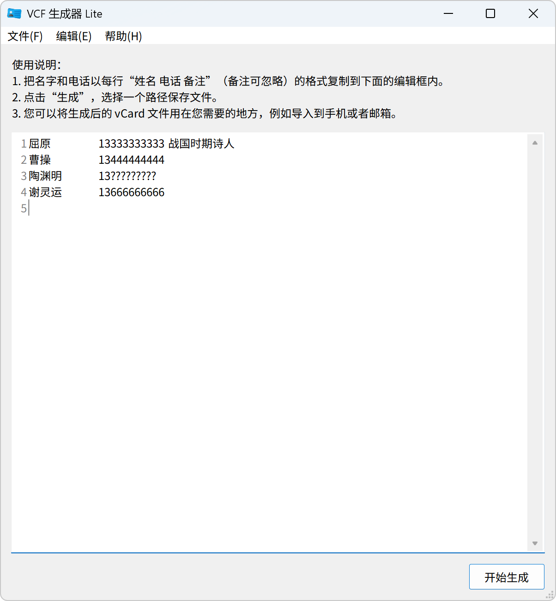
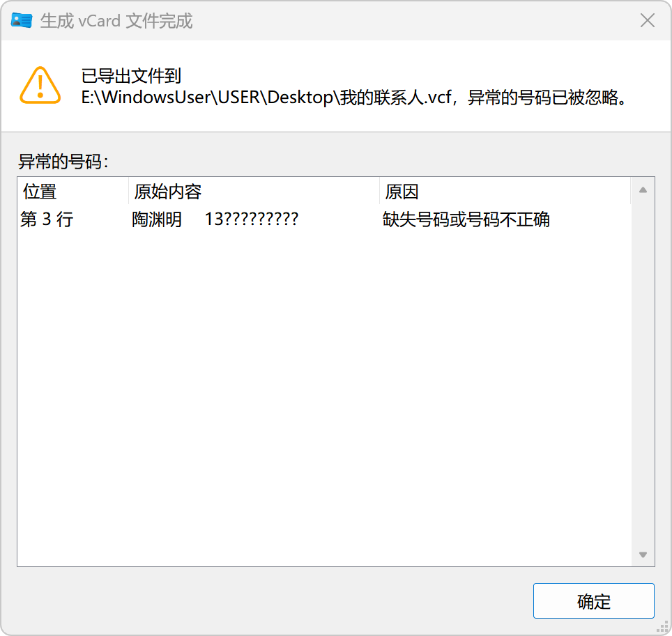

<div align="center">


# VCF 生成器 Lite 

**仓库**：
[][repository-gitee]
[][repository-github]

**平台**：
[][release-gitee]
[][release-gitee]

**语言**：
**简体中文** |
[English](./README.md) |
<small>期待您的翻译！</small>

</div>

VCF 生成器 Lite 是一个简单高效的工具，可以将联系人列表转换为单个 vCard (`.vcf`) 文件。生成的文件可以批量导入到手机通讯录或用于其他各种用途。

使用 Python 和 Tkinter 构建，提供原生桌面体验。

[](./LICENSE)
[](./CODE_OF_CONDUCT.zh-CN.md)

[][workflow-test]
[][release-github]

[][stargazers-gitee]

## 特性

- **智能解析**：按 `姓名 电话 备注` 格式识别联系人，自动合并制表符和空格。
- **批量生成**：将所有联系人合并生成单个 `.vcf` 文件。
- **号码校验**：自动跳过无效号码，并快速定位错误行。
- **辅助编辑**：文本区显示行号，支持一键删除引号。
- **本地化**：支持简体中文与英语，支持识别中国（含港澳台地区）电话号码。
- **轻量化**：提供 Python ZIP 应用包格式。
- **免费开源**：遵循 Apache License 2.0 开源，无广告，无需付费。

## 软件截图




## 下载与安装

通过以下渠道下载软件包：

- [Gitee 发行版][release-gitee]（推荐中国大陆地区用户使用）
- [GitHub Releases][release-github]

根据您的平台选择软件包，点击指南查看详细的安装和启动方法：

| 平台    | 软件包类型      | 需要安装 | 文件                                                        | 指南                                                                |
| ------- | --------------- | -------- | ----------------------------------------------------------- | ------------------------------------------------------------------- |
| Windows | 安装程序        | 是       | VCFGeneratorLite-v\<应用版本\>-**win-amd64**--*setup.exe*   | [Windows 安装程序](./docs/guides/installation/windows-installer.md) |
| Windows | 便携包          | 否       | VCFGeneratorLite-v\<应用版本\>-**win-amd64**-*portable.zip* | [Windows 便携包](./docs/guides/installation/windows-portable.md)    |
| 跨平台  | Python Wheel    | 可选     | vcf_generator_lite-\<应用版本\>-**py3-none-any**.*whl*      | [Python Wheel](./docs/guides/installation/wheel.md)                 |
| 跨平台  | Python ZIP 应用 | 否       | VCFGeneratorLite-v\<应用版本\>-**py3**.*pyzw*               | [Python ZIP 应用](./docs/guides/installation/zipapp.md)             |

## 使用方法

1. 把名字和电话以每行 `姓名 电话 备注` 的格式复制到主界面的文本框中，其中备注可忽略。例如：
   ```text
   屈原	13333333333	战国时期诗人
   曹操	13444444444
   陶渊明	13555555555
   谢灵运	13666666666
   ```
2. 点击 **开始生成**，选择一个路径保存文件。
3. 然后就可以在需要的地方使用生成的 vCard 文件。详情请参考 [使用 vCard 文件](./docs/guides/vcard-usage.md)。

有关更多内容请参考 [用户文档](./docs/index.md)。

有关系统要求、vCard 兼容性、已知问题等请参考 [兼容性说明](./docs/reference/compatibility.md)。

## 致谢

### AI 辅助

本项目的部分内容通过 AI 辅助生成：

- **Trae**：生成代码、文档优化、代码优化、语言翻译。
- **Qoder**：补全代码、文档优化、指导编码。
- **DeepSeek**：指导编码、生成代码、文档优化、语言翻译。
- **元宝**：指导编码、生成代码、语言翻译。
- **WorkBuddy**：审查代码、文档优化。
- **OpenCode**：文档优化。

## 许可证

本项目以 Apache 2.0 许可证授权，详情请参阅 [许可证文件](./LICENSE)。

## 第三方声明

本项目使用了第三方开源代码，您可以在 [声明文件](./NOTICES.zh-CN.md) 中查看详细信息。

## 更多文档

- [贡献指南](./CONTRIBUTING.zh-CN.md)
- [开发文档](./docs/dev/index.md)
- [用户文档](./docs/index.md)

---

<div align="center">
Copyright © 2023-2026 Jesse205
</div>

[repository-gitee]: https://gitee.com/hellotool/VCFGeneratorLiteWithTkinter/
[repository-github]: https://github.com/hellotool/VCFGeneratorLiteWithTkinter/
[release-gitee]: https://gitee.com/hellotool/VCFGeneratorLiteWithTkinter/releases/latest
[release-github]: https://github.com/hellotool/VCFGeneratorLiteWithTkinter/releases/latest
[stargazers-gitee]: https://gitee.com/hellotool/VCFGeneratorLiteWithTkinter/stargazers

[workflow-test]: https://github.com/hellotool/VCFGeneratorLiteWithTkinter/actions/workflows/test.yml
