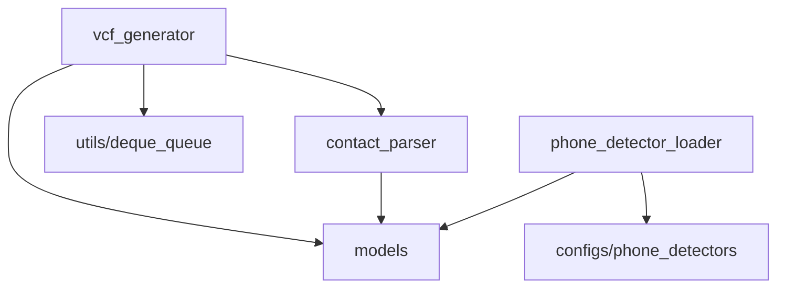

# 核心逻辑

本文介绍 `core` 模块的架构设计。`core` 模块包含与 UI 无关的业务逻辑，可独立运行和测试。

## 模块职责

| 模块                    | 职责                         | 特点                   |
| ----------------------- | ---------------------------- | ---------------------- |
| `contact_parser`        | 将单行文本解析为联系人       | 纯函数，无状态，无 I/O |
| `vcf_generator`         | 编排生成管线，管理线程和 I/O | 集成点，协调所有模块   |
| `phone_detector_loader` | 从静态配置加载号码检测器     | 无状态加载，返回字典   |

依赖方向单向：`vcf_generator` 是唯一对外入口，其余模块互不耦合，便于单独测试：

## 两阶段管线

`VCFGeneratorTask` 采用两阶段管线，让解析与写入并发执行，并用固定容量队列约束内存：

**为什么用两阶段管线：**

- **资源利用**：解析是 CPU 密集型（正则匹配），写入是 I/O 密集型（磁盘），管线让两者并发运行。
- **内存效率**：有界队列防止一次性加载全部输出。即使处理 10 万条联系人，内存中也只缓冲少量 vCard。

## 取消机制

用户点击取消时，UI 调用 `stop()`：

1. 设置 `__stopping` 标志，解析循环在下次迭代时检查并退出。
2. 调用 `queue.shutdown()`，写入端的 `queue.get()` 抛出 `ShutDownError`，立即退出。
3. 队列中剩余项被丢弃，不等待写入完成（快速响应取消）。

取消是幂等的——多次调用 `stop()` 不会产生副作用。

## 线程安全策略

- **共享状态**：`_GenerationProgress` 中的计数器由单个 `RLock` 保护所有写操作。
- **进度读取**：通知线程在无锁状态下读取快照，容忍短暂不一致，避免锁争用。
- **事件驱动**：进度变化时通过 `_progress_event` 唤醒通知线程；写入线程完成时设置 `__all_done = True` 并触发事件，确保通知线程可退出。

## 回调通信

`VCFGeneratorTask` 通过回调向 UI 层报告状态，自身不依赖 UI：

- `progress_listener(processed: int, total: int, determinate: bool)` — 进度变化时调用
- `result_listener(result: GenerationResult)` — 完成时调用

这种控制反转使得核心逻辑可以在无 UI 环境下独立运行和测试。
