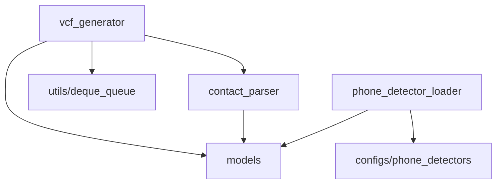

# 核心逻辑

本文介绍 `core` 模块的架构设计。`core` 模块包含与 UI 无关的业务逻辑，可独立运行和测试。

## 模块职责

| 模块                    | 职责                         | 特点                   |
| ----------------------- | ---------------------------- | ---------------------- |
| `contact_parser`        | 将单行文本解析为联系人       | 纯函数，无状态，无 I/O |
| `vcf_generator`         | 编排生成管线，管理线程和 I/O | 集成点，协调所有模块   |
| `phone_detector_loader` | 从静态配置加载号码检测器     | 无状态加载，返回字典   |

模块间依赖关系：

## 两阶段管线

`VCFGeneratorTask` 使用两阶段管线处理联系人：

**为什么用两阶段管线：**

- **资源利用**：解析是 CPU 密集型（正则匹配），写入是 I/O 密集型（磁盘），管线让两者并发运行
- **内存效率**：有界队列（容量 10）防止一次性加载全部输出。即使处理 10 万条联系人，内存中也只缓冲约 10 个 vCard
- **实时反馈**：写入一条即更新进度，用户无需等待全部解析完成

**解析阶段**（Worker 1）逐行读取输入，调用 `parse_contact` 解析文本，再调用 `serialize_to_vcard` 序列化为 vCard 字符串，推入队列。解析失败的行收集到 `InvalidItem` 列表，管线不中断。

**写入阶段**（Worker 2）从队列消费 vCard，写入目标文件。收到 `None` 哨兵时退出循环。

**哨兵终止**：Worker 1 完成所有行后向队列推送 `None`，作为流结束信号。Worker 2 以 `while (item := queue.get()) is not None` 驱动，遇到 `None` 自然退出。

## 取消机制

用户点击取消时，UI 调用 `stop()`：

1. 设置 `__stopping` 标志，解析循环在下次迭代时检查并退出
2. 调用 `queue.shutdown()`，写入端的 `queue.get()` 抛出 `ShutDownError`，立即退出
3. 已在队列中的条目在关闭前完成写入，不丢失数据

取消是幂等的——多次调用 `stop()` 不会产生副作用。

## 线程安全策略

- **计数器**（总数、已处理数等）：每个计数器由独立的 `RLock` 保护
- **进度更新**：双重检查锁定模式——先在无锁状态下比较，仅在进度变化时获取锁，减少锁竞争

## 回调通信

`VCFGeneratorTask` 通过回调向 UI 层报告状态，自身不依赖 UI：

- `progress_listener(progress, has_total)` — 进度变化时调用
- `result_listener(result)` — 完成时调用，传递 `GenerateResult`

这种控制反转使得核心逻辑可以在无 UI 环境下独立运行和测试。

## 数据模型

- `Contact`（`NamedTuple`）— 不可变的联系人数据（姓名、电话、备注）
- `MissingNumberError` — 解析失败时抛出的领域异常
- `InvalidItem` — 记录无效条目（行号、原始内容、异常）
- `GenerateResult` — 生成结果（无效项列表、异常、耗时、保存数量）
- `PhoneRule` — 号码规则（长度 + 正则验证）
- `PhoneDetector` — 按国家/地区分组的规则集合，支持合并
