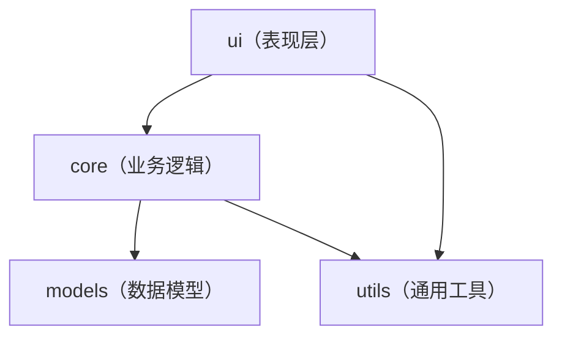

# 项目概览

本文介绍项目的技术栈、目录结构和设计目标。

## 项目结构

```text
VCFGeneratorLiteWithTkinter/
├── assets/                         # 项目资源（图标、截图等）
├── dist/                           # 构建产物（不纳入版本控制）
├── scripts/                        # 构建和辅助脚本
├── packaging/                      # 打包配置
│   ├── innosetup/                  # InnoSetup 安装程序配置
│   └── pyinstaller/                # PyInstaller 打包配置
├── src/vcf_generator_lite          # 源代码
│   ├── core/                       # 核心业务逻辑
│   ├── models/                     # 数据模型
│   ├── configs/                    # 配置（如号码检测器）
│   ├── resources/                  # 静态资源（图片、翻译文件）
│   ├── ui/                         # 用户界面
│   └── utils/                      # 通用工具
├── tests/                          # 测试文件
├── docs/                           # 用户文档
│   └── dev/                        # 开发者文档
└── pyproject.toml                  # 项目配置
```

## 分层关系



## 设计目标

### 轻量化

- 核心逻辑（解析、生成）与 UI 分离
- 核心代码可独立运行与测试
- 避免引入不必要的第三方依赖

### 原生体验

- 使用 Tkinter 提供原生桌面应用体验
- 遵循各平台的设计规范
- 避免引入额外的运行时

### 可分发

支持四种软件包形态分发：

- 单文件：Python ZIP 应用
- 便携包：Windows 便携包
- 安装包：Python Wheel 包
- 安装程序：Windows 安装程序

### 可扩展

- 号码格式通过配置管理
- 主题系统支持自定义补丁
- UI 布局模块化设计
