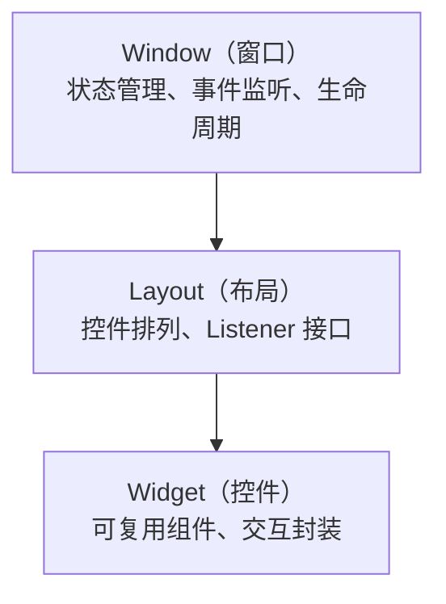

# 表现层

本文介绍 VCF 生成器 轻量版 的用户界面架构。

## 三层组织

UI 按 **窗口 → 布局 → 控件** 三层组织，每层只向下依赖，替换主题或布局时不影响业务逻辑：



## 窗口层

窗口负责业务状态、事件监听和生命周期管理。

**位置：** `ui/windows/<name>/window.py` 或 `ui/windows/<name>/dialog.py`

**主要窗口：**

| 窗口           | 文件                             | 说明                                        |
| -------------- | -------------------------------- | ------------------------------------------- |
| 主窗口         | `main_window/window.py`          | 应用核心界面，`VCFGeneratorLiteApp` 类      |
| 无效条目对话框 | `invalid_items_dialog/dialog.py` | 显示无法解析的条目，`InvalidItemsDialog` 类 |

**基类：**

- `EnhancedTk` — 增强型主窗口基类，自动应用主题补丁、设置应用图标、Windows 下居中显示。
- `EnhancedToplevel` — 增强型顶级窗口，相对父窗口居中。
- `EnhancedDialog` — 增强型对话框，Escape 键触发退出。

**职责：**

- 管理窗口生命周期（创建、显示、销毁）。
- 处理用户交互事件。
- 维护业务状态。
- 执行业务逻辑。

## 布局层

布局负责将控件组织为可视化结构，通过 `Listener` 接口向窗口回传事件。

**位置：** `ui/windows/<name>/layout.py`

**基类：**

- `VerticalDialogLayout` — 垂直对话框布局抽象基类，将窗口分为 header/content/footer 三个区域。

**职责：**

- 创建和排列控件。

**示例：**

```python
class MainLayout(VerticalDialogLayout):
    def _create_header(self, parent: tk.Widget) -> tk.Widget | None:
        # 创建使用说明标签
        return ttk.Label(parent, text="使用说明")

    def _create_content(self, parent: tk.Widget) -> tk.Widget | None:
        # 创建文本编辑区 + 行号栏
        self._text = ScrolledText(parent)
        self._line_bar = LineNumberBar(self._text)
        return self._text

    def _create_footer(self, parent: tk.Widget) -> tk.Widget | None:
        # 创建进度条 + 按钮
        return ttk.Frame(parent)
```

## 控件层

控件是可复用的 UI 组件，封装了特定的交互模式。

**位置：** `ui/widgets/*.py`

**主要控件：**

| 控件               | 文件                   | 说明                                                     |
| ------------------ | ---------------------- | -------------------------------------------------------- |
| 带行号的文本框     | `line_number_bar.py`   | `LineNumberBar` 类，显示行号、支持行选择、拖拽选择多行。 |
| 带滚动条的树形控件 | `scrolled_treeview.py` | `ScrolledTreeview` 类，用于无效条目列表。                |
| 文本框右键菜单     | `text_menu.py`         | `TextContextMenu` 类，提供撤销、重做、剪切等功能。       |

## 主题系统

主题相关代码集中在 `ui/themes/`。

**功能：**

- 提供内置主题补丁（`DefaultThemePatcher`）。
- 处理高分屏适配（按钮/树视图/滚动条 padding）。
- 修复系统主题在 Tkinter 上的显示问题。
- 支持自定义主题扩展。

**抽象接口：**

- `ThemePatcher(ABC)` — 定义 `patch()` 方法。
- `BaseThemePatcher` — 持有 `app: Tk` 和 `style: Style` 引用。
