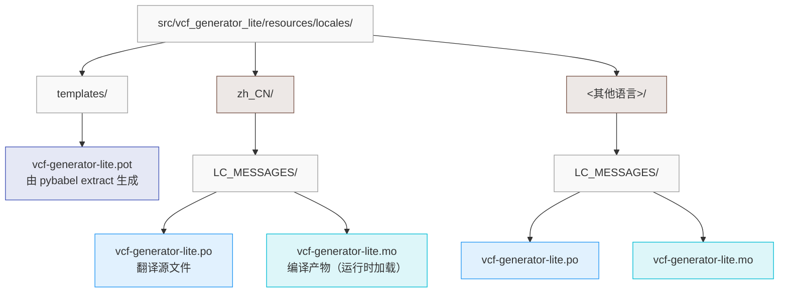

# 翻译指南

本文介绍如何翻译 VCF 生成器 Lite 的界面文本。

## 文件结构



## 常用命令

通过 Poe the Poet 任务运行：

| 命令                                       | 说明                           |
| ------------------------------------------ | ------------------------------ |
| `uv run poe l10n-extract`                  | 重新生成 `.pot` 模板           |
| `uv run poe l10n-init --locale <locale>`   | 初始化新的语言（生成 `.po`）   |
| `uv run poe l10n-update`                   | 更新已有 `.po`（合并新字符串） |
| `uv run poe l10n-compile`                  | 编译所有语言为 `.mo`           |
| `uv run poe l10n-compile -locale <locale>` | 编译指定语言                   |

## 翻译流程

> [!TIP]
>
> **使用 AI 辅助翻译**
>
> 您可以使用 GitHub Copilot、Trae 等现代 AI 工具，只需用自然语言描述需求，AI 会自动完成语言文件初始化、逐条翻译、处理变量占位符和 fuzzy 标记，并编译生成 `.mo` 文件。
>
> **示例提示词**：`把应用界面翻译成法语。`

### 1. 提取字符串

修改源码后，重新生成模板：

```bash
uv run poe l10n-extract
```

### 2. 新增语言

`--locale` 参数遵循 gettext 命名约定，格式为 `language_territory.codeset@modifier`，例如下 `fr_FR` 表示法语（法国）。

```bash
uv run poe l10n-init --locale fr_FR
```

然后编辑生成的 `src/vcf_generator_lite/resources/locales/<locale>/LC_MESSAGES/vcf-generator-lite.po`。

### 3. 更新已有翻译

同步翻译模板：

```bash
uv run poe l10n-update
```

然后编辑对应语言的 .po 文件。新出现的 msgid 会被自动追加到所有 .po 文件中，已翻译的 msgstr 保持不变。

### 4. 编译

翻译完成后，需要编译为二进制格式：

```bash
uv run poe l10n-compile
```

> [!IMPORTANT]
>
> 一定要提交编译后的 `.mo` 文件，否则在打包产物中将无法显示翻译。

### 5. 测试翻译

启动应用查看翻译效果：

```bash
LANGUAGE=<locale> uv run python -m vcf_generator_lite
```

## 注意事项

### 处理变量占位符

部分字符串包含变量占位符，翻译时必须保留：

```po
msgid "Generated {count} contacts"
msgstr "已生成 {count} 个联系人"
```

> [!IMPORTANT]
>
> - 保留花括号 `{}` 及其中的变量名
> - 可以调整占位符在句子中的位置
> - 不要修改变量名

### 处理 fuzzy 标记

如果 `msgstr` 前有 `#, fuzzy` 标记，表示该翻译可能不准确，需要人工核对：

```diff
 #: src/vcf_generator_lite/ui/windows/invalid_items_dialog/layout.py:118
-#, fuzzy
 msgctxt "common.button_ok"
 msgid "OK"
-msgstr "好的"
+msgstr "确定"
```

确认翻译正确后，删除 `#, fuzzy` 行。

## 提交翻译

翻译完成后，提交 Pull Request：

1. 确保 MO 文件已编译
2. 测试翻译效果
3. 创建 PR，说明翻译的语言
