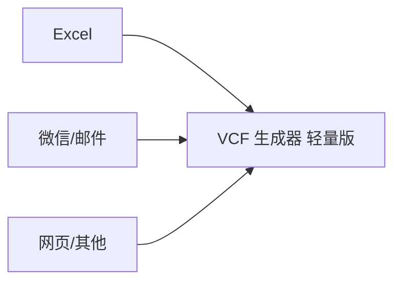

# 导入联系人

无论您的联系人数据来自 Excel、微信、邮件还是网页，都可以通过复制粘贴的方式导入到应用中。

## 通用操作步骤

1. 从任意来源复制联系人数据（<kbd>Ctrl</kbd>+<kbd>C</kbd>）。
2. 打开 VCF 生成器 轻量版。
3. 在文本框中粘贴（<kbd>Ctrl</kbd>+<kbd>V</kbd>）。

数据格式为 `姓名 电话 备注`。详细规则请参阅 [输入格式规范](../reference/input-format.md)。

## 从 Excel 导入（详细步骤）

如果您从 Excel 导入数据，请按以下步骤操作：

1. 调整 Excel 中的字段顺序，使其与 `姓名 电话 备注` 一致。
2. 选中需要导入的联系人数据并复制（<kbd>Ctrl</kbd>+<kbd>C</kbd>）。
3. 打开 VCF 生成器 轻量版。
4. 在文本框中粘贴（<kbd>Ctrl</kbd>+<kbd>V</kbd>）。

> [!IMPORTANT]
>
> **请勿复制表头行**。如果粘贴的内容包含表头（如“姓名”“电话”），该行会被判定为无效条目。
