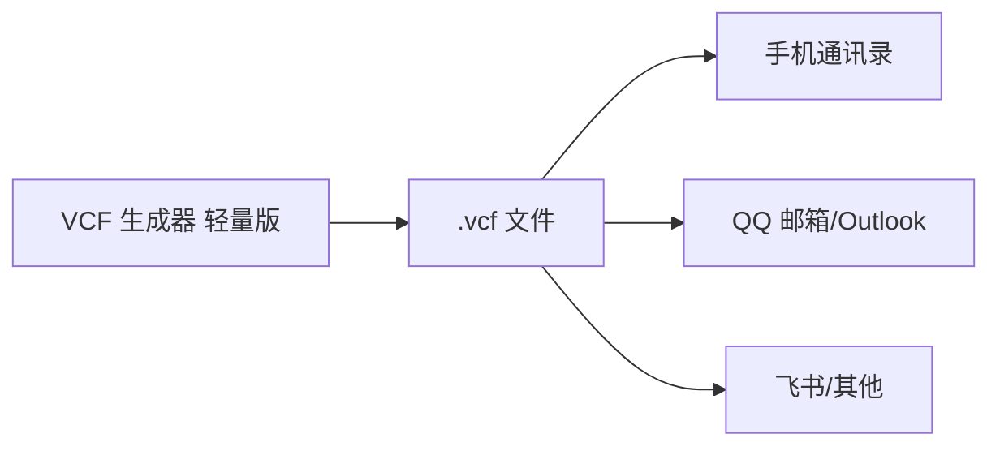

# 使用 vCard 文件

生成 vCard 文件后，您可以将其导入到各类设备和服务中。

## 导入到手机通讯录

1. 将 vCard 文件（`.vcf`）传输到手机。您可以通过以下方式传输：
   - 通过 [华为分享][huaweishare-help]、[小米妙享][xiaomishare-help]、[LocalSend][localsend-website] 等分享工具传输。
   - 使用 [微信][weixin-filehelper]、QQ 等即时通讯应用传输。
   - 使用数据线将手机连接到电脑传输。
   - 通过邮件发送给自己。
2. 在手机上打开 vCard 文件。
3. 在打开方式对话框中，选择 **通讯录**（或 **联系人**），然后根据提示操作。
4. 等待导入完成。

## 导入到 QQ 邮箱

1. 打开新版 [QQ 邮箱网站][qq-mail]。
2. 在侧边栏中，选择 **应用 > 联系人**，然后选择 **管理 > 导入联系人**。
3. 在对话框中，点击 **选择文件** 按钮，选择您的 vCard 文件。
4. 点击 **开始导入**，等待导入完成。

## 导入到飞书

1. 打开飞书客户端。
2. 在侧边栏中，选择 **通讯录 > 邮箱通讯录**，然后选择 **添加 > 导入联系人** 按钮。
3. 在对话框中，选择或拖入您的 vCard 文件。
4. 点击 **导入**，等待导入完成。

## 更多用途

有关 vCard 文件的更多用途，请参阅各应用的官方文档或帮助中心。

[huaweishare-help]: https://consumer.huawei.com/cn/support/huaweishareonehop/
[xiaomishare-help]: https://pc.mi.com/xiaomishare_help

[localsend-website]: https://localsend.org/zh-CN

[qq-mail]: https://mail.qq.com/
[weixin-filehelper]: https://filehelper.weixin.qq.com/
